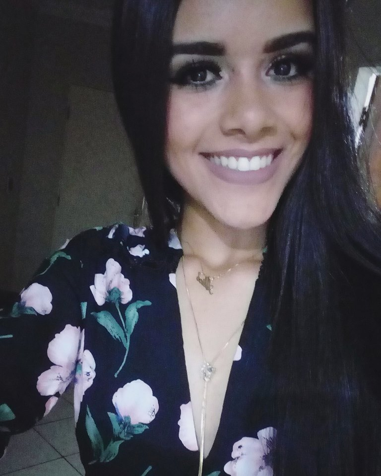
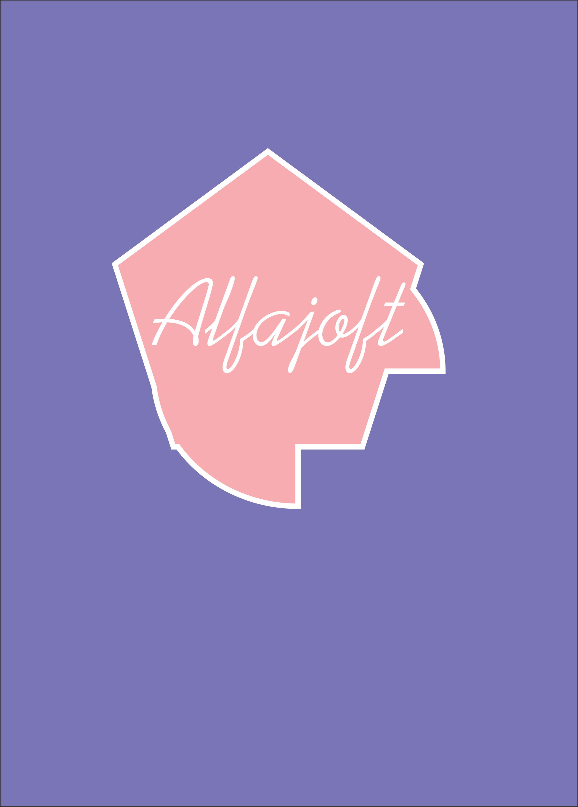
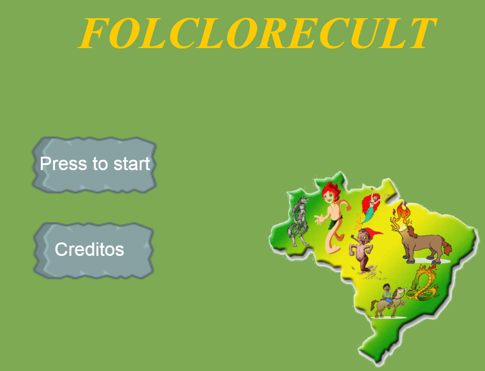
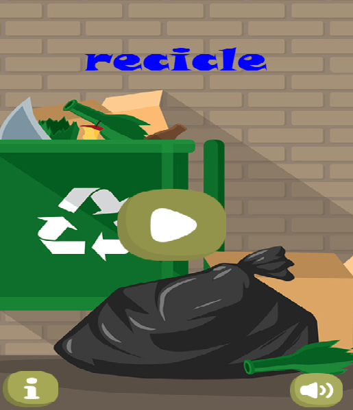
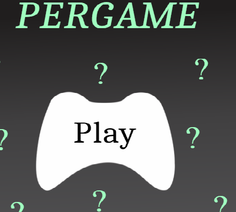
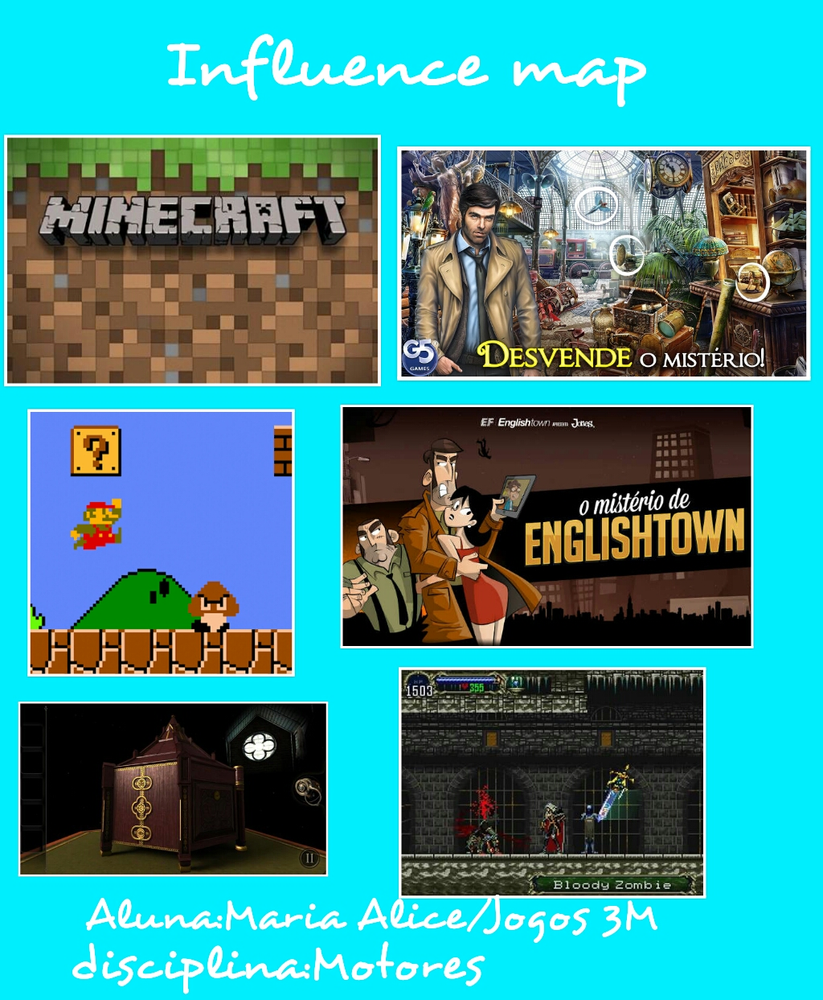

#  Quem sou eu?

Maria Alice,17.Estudante do curso de Programação de Jogos Digitais !

# Empresas que já participei

#  Games Produzidos

[Jogo 1 : Folclorecult](https://eliciaa.github.io/Folclorecult)

[Jogo 2:  Recicle](https://alicinhaa.github.io/Recicle)

 

[Jogo 3:  Pergame](https://eliciaa.github.io/Pergame)

  

#  Artes 

Influence Map produzudo para a disciplina de motores

#  Apresentações
* Aula de Oficina e motores de jogos  
* Ainda não submetido em nenhum evento fora da instituição de ensino
  
# Redes Sociais

1.Facebook:Maria Alice Oliveira

2.Instagram: @marialicees_

3.Email: aliceoliveira.maso@gmail.com 

***

**negrito
_italico
~~riscando
  dois espaços p/ pular a linha 
  3 * adiciona uma linha horizontal
  #s uma ou mais hastags criam capitulos ou sub
  *s os Asteriscos adicionam uma lista não numerada 
  1s numeros adicionam lista numerada
  
  ***
