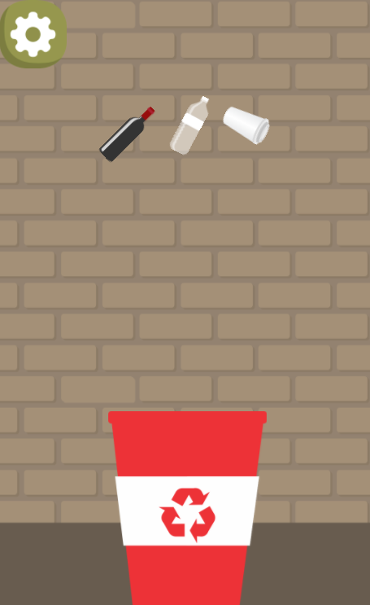

#  Quem sou eu?

Maria Alice,18.Estudante do curso de Programação de Jogos Digitais !

 

# Empresas que já participei

#  Games Produzidos

* Descrição: Um jogo que imerge o jogador e relembra conceitose figuras culturais do povo brasileiro.
[Jogo 1 : Folclorecult](https://eliciaa.github.io/Folclorecult)

* Descrição: Jogo que tem como objetivo reforçar as práticas conscientes da separação de lixo,pelo processo de reciclagem.
[Jogo 2:  Recicle](https://alicinhaa.github.io/Recicle)

 

* Descrição: Um quiz sobre conceitos e curiosidades a respeito da área de jogos
[Jogo 3:  Pergame](https://eliciaa.github.io/Pergame)

  

* Descrição : Tower defense produzido para o projeto integrador e a disciplina de oficina,a respeito do sistema imunológico

[Jogo 4:  Imuno defense](https://eliciaa.github.io/imuno)

* Descrição : Jogo produzido para o primeiro bimestre da disciplina de Oficina (2018)

[Jogo 5: Climbing courage](https://alicinhaa.github.io/Climbcou/)

[Jogo 6: Save the princess](https://alicinhaa.github.io/STP/)

#  Artes 

* Descrição : Fase do jogo Recicle

 

Influence Map criado para a disciplina de motores!

#  Apresentações
* Aula de Oficina e motores de jogos  
* Ainda não submetido em nenhum evento fora da instituição de ensino
  
# Redes Sociais

1.[Facebook:Maria Alice Oliveira](https://www.facebook.com/profile.php?id=100005702672986)

2.[Instagram: @marialicees_](https://www.instagram.com/marialicees_/?hl=pt-br)

3.[Email: aliceoliveira.maso@gmail.com](https://mail.google.com/mail/u/0/#inbox?compose=161c2b6dfd5ea0d7)

***

**negrito
_italico
~~riscando
  dois espaços p/ pular a linha 
  3 * adiciona uma linha horizontal
  #s uma ou mais hastags criam capitulos ou sub
  *s os Asteriscos adicionam uma lista não numerada 
  1s numeros adicionam lista numerada
  
  ***
